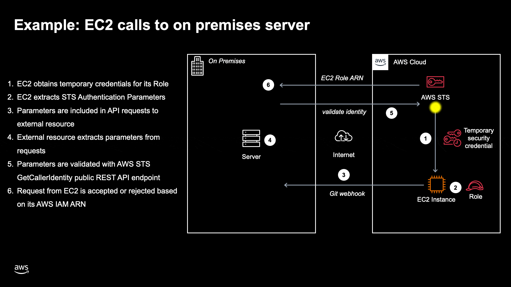

# go-aws-sts-authenticator

[](https://opensource.org/licenses/MIT) [](https://github.com/KlemenKozelj/go-aws-sts-authenticator/actions/workflows/main.yaml) 

**go-aws-sts-authenticator** is a lightweight open-source project developed in Go. The primary objective of this project is to simplify API request authentication by reusing AWS IAM and STS services. It was inspired by Mongo's Atlas password-less database authentication mechanism, please see the credit section below for details.

### Install
```
go get github.com/klemenkozelj/go-aws-sts-authenticator
```

### Usage

[Script](example/main.go) for demonstrative execution that showcases how STS parameters retrieval on client its verification on server:
```
git clone https://github.com/KlemenKozelj/go-aws-sts-authenticator.git
cd go-aws-sts-authenticator/example
go run main.go // AWS IAM ARN = arn:aws:iam::123456789012:user/klemen.kozelj@gmail.com
```
#### On Client
Client needs to have configured AWS IAM identity (user or role).
```golang
// NewClient creates a new StsAuthenticator client with default AWS environment configuration.
signatureClient, err := client.NewClient(ctx)

// Generates STS temporary credentials and from them derives authentication parameters.
xAmzDate, authorization, xAmzSecurityToken, awsRegion, err := signatureClient.GetStsParameters(ctx)

// We can also directly sign http.Request and parameters will be attached to request headers.
err := signatureClient.SignRequest(req)
```

#### On Server
The server is calling the public AWS STS (Security Token Service) endpoint with the provided authentication parameters and does not require any AWS configuration.
```golang
// Validates authentication parameters, if successful callers IAM ARN identity is located in awsGetCallerIdentityResponse.GetCallerIdentityResult.Arn
awsIdentity, err := server.StsGetCallerIdentity(xAmzDate, authorization, xAmzSecurityToken, awsRegion)
```
Validation is most frequently done in the context of an HTTP web server, http.Handler middleware functions are included for this purpose:
```golang
mux := http.NewServeMux()

// Request is authenticated if callers AWS IAM ARN is equal to arn:aws:iam::1234567890:user/username
stsAuthenticationMiddleware := server.AuthenticateAwsIamIdentity(
    server.DefaultGetRequestParameters, // type GetRequestParameters func(r *http.Request) (awsRegion, xAmzDate, xAmzSecurityToken, authorization string, err error)
    server.DefaultIsIamIdentityValid("arn:aws:iam::1234567890:user/username"), // type IsIamIdentityValid func(awsIamIdentityArn string) (valid bool)
)

handler := http.HandlerFunc(func(w http.ResponseWriter, r *http.Request) {
    w.WriteHeader(http.StatusOK)
    fmt.Fprintln(w, "Hello World")
})

mux.Handle("/", stsAuthenticationMiddleware(handler))
```
### External Dependencies
- [aws-sdk-go-v2](https://github.com/aws/aws-sdk-go-v2)

### Potential Improvements
- [ ] improve code testability with mocking aws-sdk-go-v2
- [ ] tests for client.go
- [ ] exponential back-off retry strategy for server's http client
- [ ] possibility to insert custom server's http client
- [ ] in-code documentation, benchmark and examples

### Credits

Mongo's Atlas password-less database authentication mechanism:
- [Set Up Passwordless Authentication with AWS IAM](https://www.mongodb.com/docs/atlas/security/passwordless-authentication/)
- [Using AWS IAM Authentication with MongoDB 4.4 in Atlas to Build Modern Secure Applications](https://www.youtube.com/watch?v=99iV9lCctrU)

Scanned with:
- [GoSec - Golang Security Checker](https://github.com/securego/gosec)